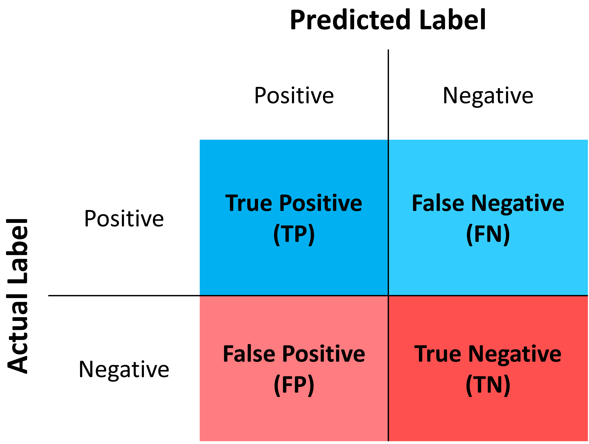

Theory
######
This section aims to clarify the key concepts that underpin the operation of the scParadise library. Below are the characteristics of the scAdam and scEve models. Additionally, the quality control metrics used by scNoah are explained.

Model
*****
A machine learning model is a computational framework or program that has been trained to recognize patterns and make predictions based on input data. It is the result of applying a machine learning algorithm to a dataset, allowing the model to learn from the data and generalize its knowledge to new, unseen instances.

Key Characteristics
===================

1. Training: Machine learning models are created through a training process where they learn from data. During this phase, the algorithm optimizes its parameters to minimize prediction errors, resulting in a model capable of making accurate predictions.

2. Types of Learning:

   * Supervised Learning: The model is trained on labeled data, where each input is paired with the correct output (e.g., classification, regression - :ref:`scAdam <scAdam>`, :ref:`scEve <scEve>`, `celltypist <https://www.celltypist.org/>`_, `scGPT <https://scgpt.readthedocs.io/en/latest/>`_).
  
   *	Unsupervised Learning: The model learns from unlabeled data to identify patterns or groupings without explicit instructions (e.g., clustering - KNN, K-means).
   *	Semi-Supervised Learning: Combines labeled and unlabeled data for training, enhancing performance when labeled data is limited.
   *	Reinforcement Learning: The model learns by interacting with an environment and receiving feedback in the form of rewards or penalties.

3. Output: Once trained, a machine learning model can make predictions on new data. For example, it can classify cells or images, predict numerical values, or recognize speech based on previously unseen inputs.

4. Storage: Machine learning models can be saved as files or objects, allowing them to be reused for future predictions without needing retraining. 

.. _scAdam:
scAdam models
*************
The scAdam model is a component of the scParadise framework, which is designed for fast reference-free multi-level multi-label cell type annotation. 

Overview of scAdam 
==================
*	Purpose: scAdam is primarily used for multi-level cell type annotation in single-cell datasets. It aims to enhance the accuracy and consistency of cell type predictions, particularly for rare cell types that are often challenging to identify with traditional methods.
*	Functionality: The model incorporates several key steps in its pipeline:
    1.	Feature Selection (optional): scAdam begins by selecting significant features (genes) that are most relevant for the classification task. This includes identifying highly variable genes and excluding those that do not contribute meaningfully to distinguishing between different cell types.
    2.	Automated Dataset Balancing (optional): Given the imbalanced nature of many single-cell datasets (where certain cell types are underrepresented), scAdam employs techniques to balance the dataset, ensuring that all classes are adequately represented during training.
    3.	Model Training: The model is then trained using the selected features and balanced data, allowing it to learn patterns associated with different cell types. We recommend using **balanced_accuracy** as an evaluation metric.

Key Features
============
*	High Accuracy and Balanced Accuracy: scAdam has been shown to surpass existing methods in annotating rare cell types, achieving high average accuracy and balanced_accuracy across diverse datasets.

*	Robustness: The model provides consistent results even when applied to different test datasets, which is crucial for reproducibility in scientific research.

*	Multi-task Learning: scAdam supports multitasking capabilities, enabling it to extract individual cell types for more targeted investigations.

Applications
============
scAdam is particularly valuable in biomedical research where understanding cellular composition and interactions within tissues is critical. By providing accurate annotations of cell types from complex single-cell datasets, it aids researchers in exploring tissue architecture and cellular functions more effectively. 

.. _scEve:
scEve models
*************
The scEve models are part of the scParadise framework, which is designed for advanced analysis of single-cell RNA sequencing (scRNA-seq) data. Here’s a detailed overview based on the information provided:

Overview of scEve
==================
*	Purpose: The scEve models are specifically focused on predicting cell surface protein abundance. This capability is crucial for understanding cellular functions and interactions at a granular level, providing insights into how cells communicate and operate within tissues.
*	Functionality:
    1. Surface Protein Prediction: scEve utilizes the expression data from selected features (genes) to make predictions about the abundance of specific cell surface proteins. This is important for identifying and characterizing different cell types based on their protein markers.
    2. Integration with scAdam: The scEve models complement the scAdam models, which are focused on multi-level cell type annotation. Together, they enhance the overall analysis pipeline by providing both annotations and functional insights regarding cell surface markers.

Key Features
============
* Enhanced Clustering and Cell Type Separation: The scEve models improve the clustering of cells and the separation of different cell types within single-cell datasets. This is particularly valuable in complex tissues where multiple cell types may be present in close proximity.
* Visualization and Analysis Tools: By predicting surface protein levels, scEve aids in visualizing cellular composition and interactions, facilitating deeper biological insights.
* Fast and Reliable: The models are designed to be efficient, enabling rapid analyses that are essential in modern biomedical research.

Applications
============
The applications of scEve models include:
* Cell Sorting: By predicting surface protein markers, researchers can isolate specific subpopulations of cells for further study. This is particularly useful in applications such as immunology and cancer research, where understanding specific cell types is critical.
* Functional Studies: The information gleaned from surface protein predictions can guide experiments aimed at understanding cellular functions and interactions within various biological contexts. 

scNoah metrics
**************

The scNoah models are part of the scParadise framework, which is designed for benchmarking of cell type annotation methods and modality prediction in scRNA-seq data.

Overview of scNoah
==================
*	Purpose: scNoah serves as a benchmarking tool within the scParadise framework. Its primary function is to evaluate the performance of cell type annotation and modality prediction methods, ensuring that these processes are reliable and accurate.

*	Functionality:
   1. Unified Benchmarking: scNoah provides a unified approach to assess various automatic cell type annotation methods and modality prediction techniques. This is crucial for comparing different models and understanding their strengths and weaknesses.
   2. Comprehensive Metrics: The model employs a range of classic machine learning metrics, such as accuracy, balanced accuracy, precision, sensitivity, specificity, F1-score, and geometric mean. These metrics help in evaluating the quality of predictions made by different models.

Key Features
============

*	Visualization Tools: scNoah includes tools for visualizing prediction performance using normalized confusion matrices. This allows researchers to see how well each model performs across different cell types, highlighting areas where predictions may be inconsistent or inaccurate.

*	Detailed Quality Assessment: The model emphasizes the need for a thorough evaluation of cell type annotation methods by recommending the use of multiple test datasets. This approach helps ensure reproducibility and reliability in predictions across diverse datasets.

*	Support for Modality Prediction: In addition to benchmarking cell type annotation, scNoah also facilitates the assessment of modality prediction methods, making it a versatile tool within the scParadise framework.

Applications
============
scNoah is particularly useful in:

*	Comparative Studies: scNoah can be used to evaluate and compare the effectiveness of various existing methods for cell type annotation and modality prediction, assisting in the selection of the most appropriate approach for specific datasets.

*	Quality Control: By providing detailed metrics and visualizations, scNoah helps maintain high standards in the analysis of single-cell data, ensuring that findings are robust and reproducible. 

Where:

1. True Positives (TP): The number of correct positive predictions made by the model.

2. False Positives (FP): The number of incorrect positive predictions made by the model.

3. True Negatives (TN): The number of correct negative predictions made by the model (model accurately identified instances that do not belong to the positive class).

4. False Negatives (FN): The number of actual positive instances that were incorrectly predicted as negative by the model.

For the tasks of automatic cell type identification in scNoah, the following quality metrics are available: :ref:`precision <Precision>`, :ref:`recall <Recall>`, :ref:`specificity <specificity>`, :ref:`F1-score <F1score>`, :ref:`accuracy <Accuracy>`, :ref:`balanced accuracy <Balancedaccuracy>`, :ref:`geometric mean <geometricmean>`, and the :ref:`index of balanced accuracy of the geometric mean <ibagm>`.

For the tasks of predicting the presence of surface proteins in scNoah, the following quality metrics are available: :ref:`RMSE <RMSE>`, :ref:`MedianAE <MedianAE>`, :ref:`MeanAE <MeanAE>`, :ref:`EVS <EVS>`, and :ref:`R² score <Rscore>`.

.. _Precision:
Precision
=========
Precision is a key metric in machine learning that evaluates the accuracy of a model's positive predictions. It is defined as the ratio of true positive predictions to the total number of instances predicted as positive (which includes both true positives and false positives). Usefull for scAdam model quality control.

Mathematically, precision can be expressed as:

.. math::
   Precision = \frac {True\,Positives\,(TP)}{True\,Positives\,(TP) + False\,Positives\,(FP)}

Interpretation
--------------
Precision answers the question: "Of all the instances predicted as positive, how many were actually positive?" A higher precision indicates that a larger proportion of predicted positives are indeed correct, which is particularly important in scenarios where false positives carry significant costs or consequences.

Example
-------
For instance, in a T cell classification task, if a model predicts 100 cells as T cells but only 80 of those are indeed T cells (20 are false positives), the precision would be:

.. math::
   Precision = \frac {80}{80+20} = \frac {80}{100} = 0.8 = 80\%

This means that 80% of the cells classified as T cells were actually T cells.

.. _Recall:
Recall/Sensitivity
==================
Recall, also known as sensitivity or the **True Positive Rate (TPR)**, is a critical metric in classification tasks that measures the ability of a machine learning model to correctly identify all relevant instances within a dataset. It quantifies how many of the actual positive cases were accurately predicted by the model.Usefull for scAdam model quality control.

Mathematically, recall/sensitivity can be expressed as:

.. math::
   Recall/Sensitivity = \frac {True\,Positives\,(TP)}{True\,Positives\,(TP) + False\,Negatives\,(FN)}

Interpretation
--------------
Recall/Sensitivity answers the question: "What fraction of actual positive instances are correctly identified by the model?" It measures the ability of a classification model to capture all relevant instances from the dataset. 

Example
-------
Suppose a T cell detection model is evaluated on a dataset containing 100 actual T cells. The model correctly identified 80 of these T cells and missed 20.

.. math::
   Recall/Sensitivity = \frac {80}{80+20} = \frac {80}{100} = 0.8 = 80\%

.. _specificity:
Specificity
===========
Specificity, also known as the **True Negative Rate (TNR)**, quantifies the proportion of actual negative cases that are correctly classified as negative by the model. In other words, it indicates how effectively a model identifies instances that do not belong to the positive class (cell type).

The formula for calculating specificity is:

.. math::
   Specificity = \frac {True\,Negatives\,(TN)}{True\,Negatives\,(TN) + False\,Positives\,(FP)}

Interpretation
--------------
1. A specificity of 100% means that all actual negative cases are correctly identified by the model, with no false positives.

2. A lower specificity indicates that the model misclassifies some negative cases as positive, which can be problematic in applications where false positives carry significant consequences (e.g., medical diagnoses).

Example
-------
Suppose a T cell detection model is evaluated on a dataset containing 100 cells. In the dataset, there are actually 20 T cells present. The model correctly identified 70 of cells as non T cells and 30 cells as T cells (10 actually not T cells).

.. math::
   Specificity = \frac {70}{70+10} = \frac {70}{80} = 0.875 = 87.5\%

.. _F1score:
F1-score
========
The F1-score is a crucial evaluation metric used in machine learning, particularly for classification tasks. It combines both precision and recall into a single score, providing a balanced measure of a model's performance. This metric is especially useful in situations where the class distribution is imbalanced or when the costs of false positives and false negatives are significant.

Mathematically, f1-score can be expressed as:

.. math::
   F1\,score = 2 \times \frac {Precision + Recall}{Precision \times Recall}

Interpretation
--------------
The F1-score ranges from 0 to 1, where:
* 0 indicates the worst performance (the model failed to identify any true positives).
* 1 indicates perfect precision and recall (the model correctly identifies all positive instances without any false positives).

A high F1 score generally signifies a well-balanced model that achieves both high precision and high recall, while a low F1 score often indicates a trade-off between these two metrics, suggesting that the model struggles to balance them effectively.

Example
-------
Suppose we evaluate the performance of a T cell detection model, and we obtain the following metrics:
* Precision: 0.85 (the model correctly identifies 85% of the T cells)
* Recall: 0.75 (the model correctly identifies 75% of all actual T cells)

.. math::
   F1\,score = 2 \times \frac {0.85 + 0.75}{0.85 \times 0.75} = 0.797 = 79.7\%

.. _geometricmean:
Geometric mean
==============
Geometric Mean (GMean) is a performance metric that is particularly useful for assessing classifiers in scenarios with class imbalance. It provides a balanced measure of a model's accuracy across different classes by focusing on the sensitivity (true positive rate) of each class.

In scNoah metrics Geometric Mean mathematically can be expressed as:

.. math::
   GMean = \sqrt{Sensitivity * Specificity}

Key Characteristics
-------------------
The Geometric mean ensures that the model performs well across all classes, not just the majority class. This is crucial in imbalanced datasets where one class may dominate.

Example
-------
Suppose we evaluate the performance of a T cell detection model, and we obtain the following metrics:
* Recall/Sensitivity: 0.75 (the model correctly identifies 75% of all actual T cells)
* Specificity: 0.95 (95% of the actual non-T cells are correctly classified as non-T cells)

.. math::
   GMean = \sqrt{0.75 * 0.95} \approx 0.844 \approx 84.4\%

.. _ibagm:
Index of balanced accuracy of the geometric mean
================================================
The **Index of Balanced Accuracy (IBA)** of the geometric mean in multi-class classification is a performance metric designed to evaluate classification models, particularly in scenarios where class distributions are imbalanced. It combines the concepts of balanced accuracy and the geometric mean of class-wise sensitivities to provide a comprehensive assessment of model performance.

.. math::
   IBA = (1 + \alpha*(Sensitivity − Specificity))*GMean^2

:math:`\alpha` is a weighting factor that adjusts the influence of the difference between sensitivity and specificity (default = 0.1).

Key Characteristics
-------------------
1. The IBA takes into account both sensitivity and specificity across all classes, ensuring that performance is evaluated fairly, especially in imbalanced datasets.

2. The IBA is particularly useful in domains such as medical diagnosis, fraud detection, and any field where misclassification of minority classes can have significant consequences.

Example
-------
Suppose we evaluate the performance of a T cell detection model, and we obtain the following metrics:
* Recall/Sensitivity: 0.75 (the model correctly identifies 75% of all actual T cells)
* Specificity: 0.95 (95% of the actual non-T cells are correctly classified as non-T cells)

.. math::
   GMean = \sqrt{0.75 * 0.95} \approx 0.844 \approx 84.4\%

.. math::
   IBA = (1 + 0.1*(0.75 − 0.95))*0.844^2 \approx 0.698 \approx 69.8\%

.. _Accuracy:
Accuracy
========
Accuracy is a fundamental metric used to evaluate the performance of machine learning models, particularly in classification tasks. It measures the overall correctness of a model's predictions by calculating the proportion of correct predictions out of the total number of predictions made.

Mathematically, accuracy can be expressed as:

.. math::
   Accuracy = \frac {Correct\,Predictions}{Total\,Predictions} = \frac {TP+TN}{TP+TN+FP+FN}

Typically, scRNA-seq datasets contain many cell types. Therefore, the problem of cell type annotation should be regarded as a multiclass classification problem. In the context of multiclass classification (scRNA-seq cell type anotation), **accuracy** can also be expressed as:

.. math::
   Accuracy = \frac {\sum_{i=1}^N TP_i}{\sum_{i=1}^N (TP_i + FP_i + FN_i)}

i is a cell type.

N is the total number of cell types.

​Interpretation
--------------
Accuracy values range from 0 to 1, or 0% to 100%. An accuracy of 1 (or 100%) indicates perfect predictions, while an accuracy of 0 means that all predictions were incorrect.

Limitations
-----------
While accuracy is a straightforward and intuitive measure, it may not always be the best indicator of model performance, especially in scRNA-seq cell type annotation.

**Accuracy paradox**

The "accuracy paradox" refers to situations where a model achieves high accuracy but performs poorly on critical aspects of the task. This often occurs in scRNA-seq cell type annotation where the majority cell type (CD14+ Monocytes in PBMC) dominates the predictions, leading to misleadingly high accuracy scores while neglecting minority cell types (Innate Lymphoid Cells in PBMC).

To obtain a more comprehensive understanding of model performance, it is essential to use additional metrics such as precision, recall, F1 score, balanced accuracy, and others that account for the specific characteristics of the problem at hand.

Example
-------
Suppose we evaluate the performance of a Monocytes and AXL+ Dendritic cells detection model on a test dataset consisting of 1000 cells. The dataset contains 950 Monocytes and 50 AXL+ Dendritic cells. The model identified that there are 990 Monocytes and 10 AXL+ Dendritic cells in the dataset. Out of the 990 Monocytes identified by the model, 940 are true Monocytes, and out of the 10 AXL+ Dendritic cells, 0 are true AXL+ Dendritic cells. 

.. math::
   Accuracy = \frac {940 + 0}{990 + 10} = \frac {940}{1000} = 0.94 = 94\%

The model has a very high level of accuracy but is unable to detect AXL+ Dendritic cells.

.. _Balancedaccuracy:
Balanced accuracy
=================
Balanced accuracy is a performance metric used to evaluate classification models, particularly in multiclass scenarios (scRNA-seq cell type annotation) where the class (cell type) distribution may be imbalanced. In scRNA-seq cell type annotation it provides a more reliable assessment of model performance by averaging the recall (sensitivity) across all cell types, ensuring that each cell type contributes equally to the final score.

In multiclass classification, balanced accuracy is calculated as the average of the recall scores for each class:

.. math::
   Balanced\,Accuracy = \frac {1}{N} \sum_{i=1}^N Recall_i

i is a cell type.

N is the total number of cell types.

Importance in scRNA-seq annotation
----------------------------------
1. Handling Imbalance: Balanced accuracy is particularly useful in situations where some cell types are significantly underrepresented. By averaging recall/sensitivity across all cell types, it mitigates the bias that can occur when using standard accuracy, which may be skewed by the majority cell type.

2. Equal Weighting: This metric ensures that each cell type has an equal impact on the overall performance evaluation, making it suitable for applications where identifying all cell types accurately is crucial.

Example
-------
Suppose we evaluate the performance of a Monocytes and AXL+ Dendritic cells detection model on a test dataset consisting of 1000 cells. The dataset contains 950 Monocytes and 50 AXL+ Dendritic cells. The model identified that there are 990 Monocytes and 10 AXL+ Dendritic cells in the dataset. Out of the 990 Monocytes identified by the model, 940 are true Monocytes, and out of the 10 AXL+ Dendritic cells, 0 are true AXL+ Dendritic cells. 

.. math::
   Recall/Sensitivity\,(Monocytes) = \frac {940}{950} = 0.989

.. math::
   Recall/Sensitivity\,(AXL+ Dendritic cells) = \frac {0}{50} = 0

.. math::
   Balanced\,Accuracy = \frac {0.989 + 0}{2} = 0.4945 = 49.45\%

The model has a very high level of accuracy and low level of balanced accuracy. Model is unable to detect AXL+ Dendritic cells.

.. _RMSE:
Root Mean Square Error (RMSE)
=============================
Root Mean Square Error (RMSE) is a statistical measure used to assess the accuracy of a predictive model by quantifying the differences between predicted values and observed values. It is particularly useful in regression analysis and various fields such as climatology, finance, and machine learning. In scParadise, RMSE is used as a quality metric for the performance of scEve models.

RMSE is defined mathematically as the square root of the average of the squared differences between predicted values (y_pred) and actual values (y_true).

.. math::
   RMSE = \sqrt{\frac {1}{N} \sum_{i=1}^N (y_{true\,i} - y_{pred\,i})^2}

N is the number of cells.

`y_true` is the actual value for observation (surface protein) i.

`y_pred` is the predicted value for observation (surface protein) i. 

Interpretation
--------------
1. Lower RMSE Values: Indicate a better fit of the model to the data, meaning that predictions are close to actual values.
2. Higher RMSE Values: Suggest poorer model performance, indicating larger discrepancies between predicted and actual values.
3. An RMSE of 0 signifies a perfect fit, where predicted values match actual values exactly, although this is rarely achieved in practice.

Example
-------
Consider a small dataset (4 cells) with actual and predicted values of CD4 surface protein expression:

* Actual Values: [3, 0.5, 2, 7]

* Predicted Values: [2.5, 0.0, 2, 8]

.. math::
   RMSE = \sqrt{\frac {(3 - 2.5)^2 + (0.5 - 0)^2 + (2 - 2)^2 + (7 - 8)^2}{4}} = \sqrt{\frac {0.25 + 0.25 + 0 + 1}{4}} \approx 0.612

.. _MedianAE:
Median Absolute Error (MedianAE)
================================
Median Absolute Error (MedianAE) is a robust statistical metric used to evaluate the performance of regression models. It measures the median of the absolute differences between predicted values and actual values, providing a clear indication of prediction accuracy while being less sensitive to outliers compared to other metrics like Mean Absolute Error (:ref:`MeanAE <MeanAE>`).

The MedianAE is defined mathematically as:

.. math::
   MedianAE = \text{median} (|y_{true\,i} - y_{pred\,i}|)

`y_true` is the actual value for observation (surface protein) i.

`y_pred` is the predicted value for observation (surface protein) i. 

The absolute difference (:math:`|y_{true} - y_{pred}|`) is calculated for each observation (surface protein).

Interpretation
--------------
1. Lower MedianAE Values: Indicate a better fit of the model to the data, meaning that predictions are close to actual values.
2. Higher MedianAE Values: Indicate greater discrepancies between predicted and actual values.
3. An MedianAE of 0 signifies a perfect fit, where predicted values match actual values exactly, although this is rarely achieved in practice.

Example
-------
Consider a small dataset (4 cells) with actual and predicted values of CD4 surface protein expression:

* Actual Values: [3, 0.5, 2, 7]

* Predicted Values: [2.5, 0.0, 2, 8]

.. math::
   MedianAE = \text{median}(| 3 - 2.5 |, | 0.5 - 0 |, | 2 - 2 |, | 7 - 8 |) = \text{median}(0.5, 0.5, 0, 1) = 0.5

.. _MeanAE:
Mean Absolute Error (MeanAE)
============================
Mean Absolute Error (MAE) is a statistical metric used to evaluate the accuracy of predictions in regression models. It measures the average absolute difference between the predicted values and the actual values, providing a straightforward way to assess model performance.

The MeanAE is defined mathematically as:

.. math::
   MeanAE = \frac {1}{N} \sum_{i=1}^N |y_{true\,i} - y_{pred\,i}|

N is the number of observations (surface proteins).

`y_true` is the actual value for observation (surface protein) i.

`y_pred` is the predicted value for observation (surface protein) i. 

The absolute difference (:math:`|y_{true} - y_{pred}|`) is calculated for each observation (surface protein).

Key Characteristics
-------------------
1. Robustness to Outliers: MAE treats all errors equally, meaning that it does not disproportionately penalize larger errors as compared to metrics like Mean Squared Error (MSE), which squares the errors.
2. Interpretability: The MAE provides a clear indication of the average magnitude of errors in predictions, making it easy to understand and communicate.

Interpretation
--------------
1. Lower MeanAE Values: Indicate a better fit of the model to the data, meaning that predictions are close to actual values.
2. Higher MeanAE Values: Suggest larger discrepancies between predicted and actual values.
3. An MeanAE of 0 signifies a perfect fit, where predicted values match actual values exactly, although this is rarely achieved in practice.

Example
-------
Consider a small dataset (4 cells) with actual and predicted values of CD4 surface protein expression:

* Actual Values: [3, 0.5, 2, 7]

* Predicted Values: [2.5, 0.0, 2, 8]

.. math::
   MeanAE = \frac {| 3 - 2.5 | + | 0.5 - 0 | + | 2 - 2 | + | 7 - 8 |}{4} = \frac {0.5 + 0.5 + 0 + 1}{4} = 0.5
